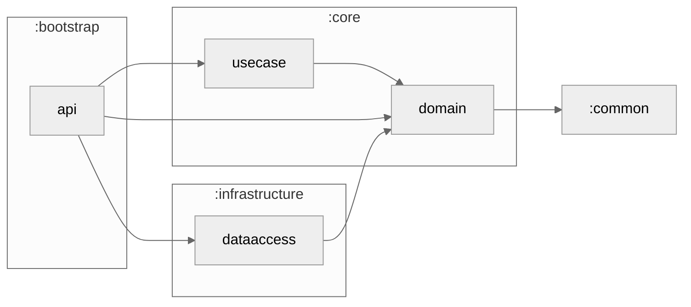

### Module Graph

```mermaid
%%{
  init: {
    'theme': 'neutral'
  }
}%%

graph LR
  subgraph :bootstrap
    :bootstrap:api["api"]
  end
  subgraph :core
    :core:usecase["usecase"]
    :core:domain["domain"]
  end
  subgraph :infrastructure
    :infrastructure:dataaccess["dataaccess"]
  end
  :core:usecase --> :core:domain
  :bootstrap:api --> :core:usecase
  :bootstrap:api --> :core:domain
  :bootstrap:api --> :infrastructure:dataaccess
  :core:domain --> :common
  :infrastructure:dataaccess --> :core:domain
```
# Post-Order 멀티모듈 예제

## 모듈 의존성 그래프

- 위에 처럼 하면 api 모듈에서 bootJar를 만들 수가 없다. 다른 모듈에 대한 의존성이 없기 때문

api 모듈에서 bootJar를 만들기 위해서는 다음과 같이 설정해야 한다.
